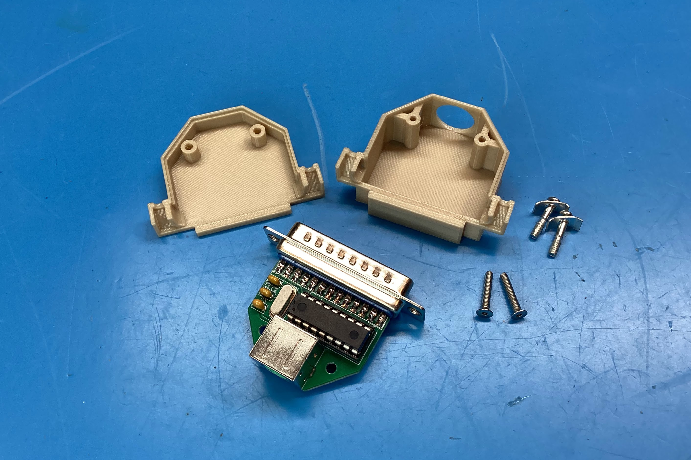
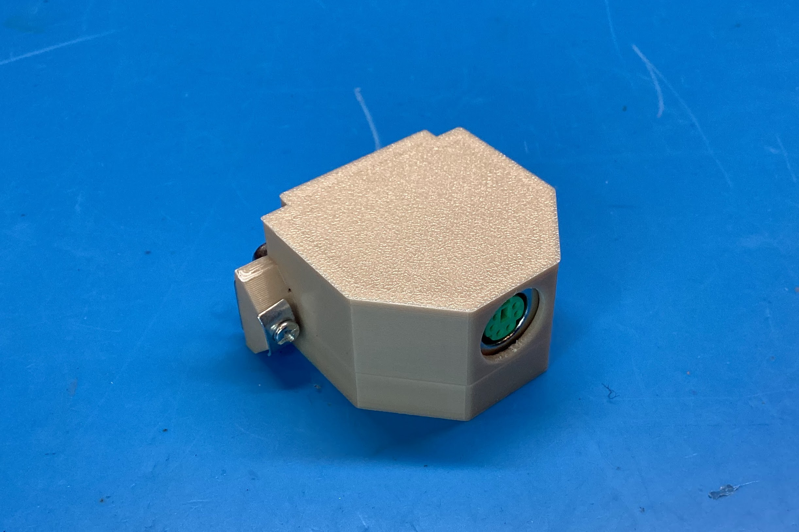

PS/2 to parallel keyboard adapter designed to plug into the 25 pin header of a Xerox 820. Based on the work shared by [enrico](https://forum.vcfed.org/index.php?members/enrico.5315/) here, https://forum.vcfed.org/index.php?threads/ferguson-big-board-1-monitor-rom.32705/#post-405189

### BOM

[https://djtersteegc.github.io/Xerox-820-Projects/Parallel-to-PS2-Keyboard-Adapter-v1.0-ibom.html](https://djtersteegc.github.io/Xerox-820-Projects/Parallel-to-PS2-Keyboard-Adapter-v1.0-ibom.html)

### Firmware Flashing

Available in the [firmware](firmware) directory.  Use your favorite Pic programmer like a Pickit3 with an adapter board or a TL866/T48.

### Revisions

#### v1.0

Tested and working

