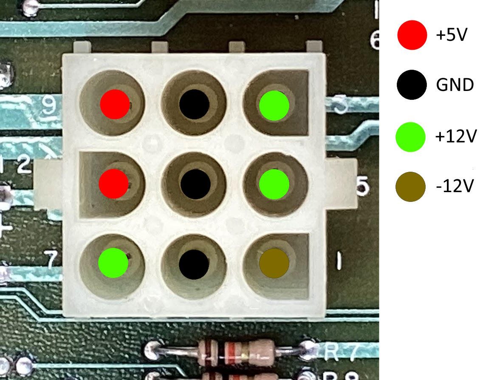

# Xerox 820 Projects
Various PCB's and info for the Xerox 820 computer.  More details at https://forum.vcfed.org/index.php?threads/xerox-820-project-time.1251315/

### [Keyboard Adapter](Parallel-to-PS2-Keyboard-Adapter)

### [Floppy Adapter](DB37-to-IDC34-Floppy-Adapter)

### [Power Supply](Power-Supply)

### Pinouts

